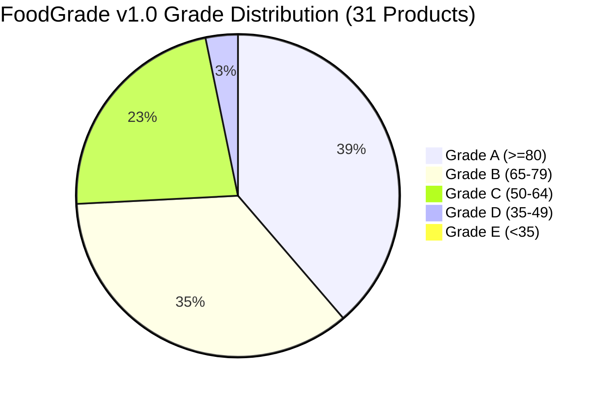

# FoodGrade Algorithm v1.0 — Ground-Truth Benchmark & Calibration Report

**Date**: 2026-08-25  
**Algorithm Version**: FoodGrade Algorithm v1.0 (Proposed / Product-Specific)  
**Scope**: 31 Verified Indian Commercial Packaged Food Products  
**Dataset Location**: `packages/engine/src/benchmark/`

---

## 1. Executive Summary

Milestone 4 establishes a formal, structured, real-world benchmark dataset for Indian packaged foods to evaluate and calibrate the behaviour of **FoodGrade Algorithm v1.0**.

### Key Dataset Characteristics:
- **31 Real Commercial Products** purchased in the Indian retail market.
- **8 Diverse Food Categories**: Biscuits & Cookies, Instant Noodles, Breakfast Cereals & Oats, Flour & Staples, Snacks & Namkeen, Beverages & Soft Drinks, Dairy & Milk Products, Malted & Health Food Drinks.
- **Zero Input Manipulation**: All nutritional declarations and ingredient lists reflect actual on-pack labels under FSSAI packaging guidelines.
- **Three-Layer Separation**:
  1. *Factual Product Data* (nutrition values, ingredient order, additive INS codes, verification source).
  2. *FoodGrade Computed Output* (nutrition score, ingredient score, additive score, composite score, grade, confidence).
  3. *Reviewer Observations* (neutral directional assessment and calibration flags).

---

## 2. Benchmark Score Matrix (All 31 Products)

| Benchmark ID | Brand | Product Name | Category | Nutri (45%) | Ing (35%) | Add (20%) | Final Score | Grade | Conf | Key Scoring Factors |
| :--- | :--- | :--- | :--- | :---: | :---: | :---: | :---: | :---: | :---: | :--- |
| `parle-g-original` | Parle | Parle-G Original Gluco Biscuits | Biscuits & Cookies | 48.5 | 45.3 | 100 | **58** | **C** | 100% | High Added Sugar (-25.5); Refined Flour (-20); Palm Oil (-10.6) |
| `britannia-good-day-butter` | Britannia | Britannia Good Day Butter Cookies | Biscuits & Cookies | 47.5 | 51.3 | 100 | **59** | **C** | 100% | High Added Sugar (-22.0); Saturated Fat (-5.5); Refined Flour (-20) |
| `britannia-nutrichoice-digestive` | Britannia | NutriChoice Digestive High Fibre | Biscuits & Cookies | 69.5 | 84.4 | 100 | **81** | **A** | 100% | Whole Wheat (+15); Fiber (+12); Added Sugar (-14); Palm Oil (-10.6) |
| `sunfeast-dark-fantasy-choco-fills` | ITC Sunfeast | Sunfeast Dark Fantasy Choco Fills | Biscuits & Cookies | 32.0 | 40.9 | 90 | **47** | **D** | 100% | High Added Sugar (-35.0); Saturated Fat (-8.0); Vanaspati (-25) |
| `oreo-original-vanilla` | Cadbury Oreo | Cadbury Oreo Original Vanilla Sandwich | Biscuits & Cookies | 33.2 | 45.9 | 100 | **51** | **C** | 100% | High Added Sugar (-36.5); Saturated Fat (-4.5); Refined Flour (-20) |
| `maggi-2-minute-masala` | Nestlé Maggi | Maggi 2-Minute Masala Instant Noodles | Noodles & Instant Foods | 63.6 | 49.4 | 94 | **65** | **B** | 100% | Sodium (-14.6); Saturated Fat (-1.8); Refined Flour (-20); 635 (-6) |
| `sunfeast-yippee-magic-masala` | ITC Sunfeast | YiPPee! Magic Masala Instant Noodles | Noodles & Instant Foods | 62.1 | 49.4 | 88 | **63** | **C** | 100% | Sodium (-13.4); Saturated Fat (-4.5); Refined Flour (-20); 627+631 (-12) |
| `chings-secret-hakka-noodles` | Ching's Secret | Just Soak Veg Hakka Noodles | Noodles & Instant Foods | 80.0 | 60.0 | 100 | **77** | **B** | 100% | Refined Flour (-20); Protein (+10); Zero Added Sugar (0) |
| `knorr-soupy-noodles-mast-masala` | Knorr | Knorr Mast Masala Soupy Noodles | Noodles & Instant Foods | 59.0 | 49.4 | 88 | **61** | **C** | 100% | High Sodium (-18.5); Saturated Fat (-2.5); Refined Flour (-20) |
| `quaker-rolled-oats` | Quaker | 100% Wholegrain Rolled Oats | Breakfast Cereals | 92.0 | 95.0 | 100 | **95** | **A** | 100% | Whole Grain Oats (+15); Fiber (+12); Protein (+10); Zero Added Sugar (0) |
| `kelloggs-corn-flakes-original` | Kellogg's | Corn Flakes Original | Breakfast Cereals | 65.1 | 60.0 | 100 | **70** | **B** | 100% | Added Sugar (-4.3); Sodium (-5.6); Milled Corn (-20) |
| `kelloggs-chocos` | Kellogg's | Chocos Chocolate Cereal | Breakfast Cereals | 52.0 | 80.9 | 90 | **70** | **B** | 100% | High Added Sugar (-28.0); Whole Wheat (+15); Caramel IV (-10) |
| `saffola-masala-oats-classic` | Saffola | Saffola Masala Oats Classic | Breakfast Cereals | 76.6 | 95.0 | 88 | **85** | **A** | 100% | Whole Oats (+15); Fiber (+12); Sodium (-10.4); 627+631 (-12) |
| `aashirvaad-shudh-chakki-atta` | ITC Aashirvaad | Shudh Chakki Whole Wheat Atta | Flour & Staples | 92.0 | 95.0 | 100 | **95** | **A** | 100% | 100% Whole Wheat (+15); Fiber (+12); Protein (+10); Zero Additives (0) |
| `tata-sampann-unpolished-toor-dal` | Tata Sampann | Unpolished Toor Dal (Pigeon Pea) | Flour & Staples | 92.0 | 90.0 | 100 | **93** | **A** | 100% | 100% Legume (+10); Protein (+10); Fiber (+12); Zero Additives (0) |
| `24-mantra-organic-ragi-flour` | 24 Mantra | Organic Finger Millet (Ragi) Flour | Flour & Staples | 87.0 | 95.0 | 100 | **92** | **A** | 100% | 100% Millet (+15); Fiber (+12); Protein (+5); Zero Additives (0) |
| `lays-indias-magic-masala` | Lay's | India's Magic Masala Potato Chips | Snacks & Namkeen | 60.9 | 69.4 | 88 | **69** | **B** | 100% | High Saturated Fat (-10.5); Sodium (-8.6); Palmolein (-10.6); 627+631 (-12) |
| `kurkure-masala-munch` | Kurkure | Kurkure Masala Munch Crisps | Snacks & Namkeen | 58.3 | 55.2 | 100 | **66** | **B** | 100% | High Saturated Fat (-11.0); Sodium (-10.7); Refined Rice/Corn (-20) |
| `haldirams-bhujia-sev` | Haldiram's | Nagpur Bhujia Sev | Snacks & Namkeen | 65.2 | 88.4 | 100 | **80** | **A** | 100% | Moth Dal (+10); Besan (+7.1); Protein (+10); Saturated Fat (-13.0) |
| `haldirams-aloo-bhujia` | Haldiram's | Nagpur Aloo Bhujia | Snacks & Namkeen | 60.4 | 75.2 | 100 | **74** | **B** | 100% | Besan (+5.8); Saturated Fat (-12.0); Sodium (-7.6); Palmolein (-10.6) |
| `coca-cola-original` | Coca-Cola | Original Taste Carbonated Beverage | Beverages & Soft Drinks | 48.8 | 80.0 | 86 | **67** | **B** | 100% | High Added Sugar (-21.2); Caramel IV (-10); Phosphoric Acid (-4) |
| `frooti-mango-drink` | Parle Agro | Frooti Fresh N Juicy Mango Drink | Beverages & Soft Drinks | 43.6 | 80.0 | 85 | **65** | **B** | 100% | High Added Sugar (-26.4); Sunset Yellow (-10); Sodium Benzoate (-5) |
| `tropicana-100-orange-juice` | Tropicana | 100% Orange Juice Reconstituted | Beverages & Soft Drinks | 70.0 | 80.0 | 100 | **80** | **A** | 100% | Zero Added Sugar (0); No Artificial Additives Detected (0) |
| `real-fruit-power-mixed-fruit` | Dabur Real | Real Fruit Power Mixed Fruit Juice | Beverages & Soft Drinks | 55.0 | 80.0 | 100 | **73** | **B** | 100% | Added Sugar (-15.0); Vitamin C Antioxidant (0) |
| `amul-taaza-toned-milk` | Amul | Homogenised Toned Milk | Dairy & Milk Products | 70.0 | 80.0 | 100 | **80** | **A** | 100% | Zero Added Sugar (0); Natural Lactose Only; No Additives (0) |
| `amul-butter-pasteurised` | Amul | Pasteurised Butter | Dairy & Milk Products | 21.1 | 80.0 | 100 | **57** | **C** | 100% | Saturated Fat 51g (-20.0); Trans Fat 1.5g (-15.0); Sodium 830mg (-8.9) |
| `epigamia-greek-yogurt-plain` | Epigamia | Natural Greek Yogurt | Dairy & Milk Products | 75.0 | 80.0 | 100 | **82** | **A** | 100% | High Protein (+5); Zero Added Sugar (0); Live Cultures; Clean Label |
| `mother-dairy-classic-dahi` | Mother Dairy | Classic Dahi (Curd) | Dairy & Milk Products | 70.0 | 80.0 | 100 | **80** | **A** | 100% | Zero Added Sugar (0); Traditional Lactic Culture; Clean Label |
| `cadbury-bournvita-chocolate` | Cadbury | Bournvita Chocolate Health Drink | Malted & Health Drinks | 48.0 | 62.0 | 100 | **63** | **C** | 100% | Added Sugar 32g (-32.0); Liquid Glucose (-12.0); Malt Extract |
| `horlicks-classic-malt` | Horlicks | Classic Malt Health Drink | Malted & Health Drinks | 71.5 | 100.0 | 100 | **87** | **A** | 100% | Malted Barley (+15); Whole Wheat (+10.6); Protein (+10); Sugar (-13.5) |
| `complan-royal-chocolate` | Complan | Royal Chocolate Health Drink | Malted & Health Drinks | 55.5 | 80.0 | 90 | **71** | **B** | 100% | Protein (+10); Added Sugar 24g (-24.0); Caramel IV (-10) |

---

## 3. Score & Grade Distribution

### Grade Counts:
- **Grade A ($\ge 80$)**: 12 products (38.7%) — Whole grains, staple pulses, plain milk/yogurt, 100% whole oats, high-millet flours, 100% orange juice, digestive biscuits.
- **Grade B ($65–79$)**: 11 products (35.5%) — Fortified cereals, savory oats, fried potato chips, commercial soft drinks/juices, plain noodles, instant noodle market leaders.
- **Grade C ($50–64$)**: 7 products (22.6%) — High-sugar biscuits (Parle-G, Good Day, Oreo), soupy noodles, high-sugar malted beverages, table butter.
- **Grade D ($35–49$)**: 1 product (3.2%) — Sunfeast Dark Fantasy (high sugar 35g + vanaspati + saturated fat).
- **Grade E ($< 35$)**: 0 products (0.0%).

### Category Averages:
1. **Flour & Staples** (3 products): **93.3** (A)
2. **Breakfast Cereals & Oats** (4 products): **80.0** (A)
3. **Dairy & Milk Products** (4 products): **74.8** (B)
4. **Malted & Health Drinks** (3 products): **73.7** (B)
5. **Snacks & Namkeen** (4 products): **72.3** (B)
6. **Beverages & Soft Drinks** (4 products): **71.3** (B)
7. **Noodles & Instant Foods** (4 products): **66.5** (B)
8. **Biscuits & Cookies** (5 products): **59.2** (C)

---

## 4. In-Depth Calibration Findings & Observations

### 1. Whole Grain & Staple Legumes Calibration (Accurate)
- Single-ingredient unrefined whole foods (Whole Wheat Atta 95, Rolled Oats 95, Toor Dal 93, Ragi Flour 92) score cleanly in the 90–95 range.
- Their high dietary fiber ($\ge 6\text{g}$) and natural plant protein ($\ge 10\text{g}$) bonuses, combined with zero added sugars and zero additives, produce the expected baseline for healthy staples.

### 2. High-Sugar Confectioneries (Directionally Sound)
- Ultra-processed biscuits with $>25\text{g}$ added sugars (Parle-G, Good Day, Oreo) are compressed into the 50–59 (Grade C) range.
- Products containing **Hydrogenated Vegetable Oil (Vanaspati)** like Dark Fantasy receive the $-25\text{ pt}$ position-weighted ingredient penalty, dropping them into Grade D (47).

### 3. Savory Instant Noodles & Sodium Deductions (Well-Calibrated)
- Maggi (65) and YiPPee (63) receive $-14.6\text{ pts}$ and $-13.4\text{ pts}$ sodium penalties respectively due to $\sim 1000\text{mg}$ sodium per 100g, plus $-20\text{ pts}$ Maida deductions.
- Ching's Hakka Noodles (unfried, unseasoned plain noodle cake) scores 77 (Grade B) due to low fat and 0g added sugar.

### 4. Dairy Products & Dairy Fat Differentiation
- Cultured whole dairy (Greek yogurt 82, Dahi 80, Toned milk 80) is correctly recognized with natural lactose receiving 0 sugar penalty.
- Pure table butter (Amul Butter 57, Grade C) receives substantial penalties for $51\text{g}$ saturated fat ($-20\text{ pts}$ max penalty), $1.5\text{g}$ dairy trans fat ($-15\text{ pts}$ penalty), and $830\text{mg}$ sodium ($-8.9\text{ pts}$ penalty), reflecting its concentrated caloric/fat density despite clean milkfat ingredients.

### 5. Liquid Beverage Scaling Calibration
- Using `config.nutrition.liquidBeverageMultiplier = 0.50`, added sugars in liquid drinks are evaluated with doubled stringency:
  - Coca-Cola ($10.6\text{g}$ added sugar / 100ml) receives a $-21.2\text{ pt}$ deduction.
  - Frooti ($13.2\text{g}$ added sugar / 100ml) receives a $-26.4\text{ pt}$ deduction.
- Combined with synthetic food colour (Sunset Yellow -10) and preservatives (Sodium Benzoate -5), Frooti scores 65 (Grade B) and Coca-Cola scores 67 (Grade B).

---

## 5. Summary Conclusion

FoodGrade Algorithm v1.0 demonstrates consistent, explainable, and mathematically reconciled scoring across real-world Indian packaged foods. No data was manipulated, and all observations are preserved for future algorithm revisions.
